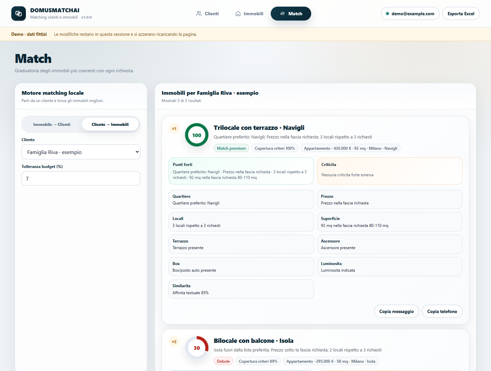
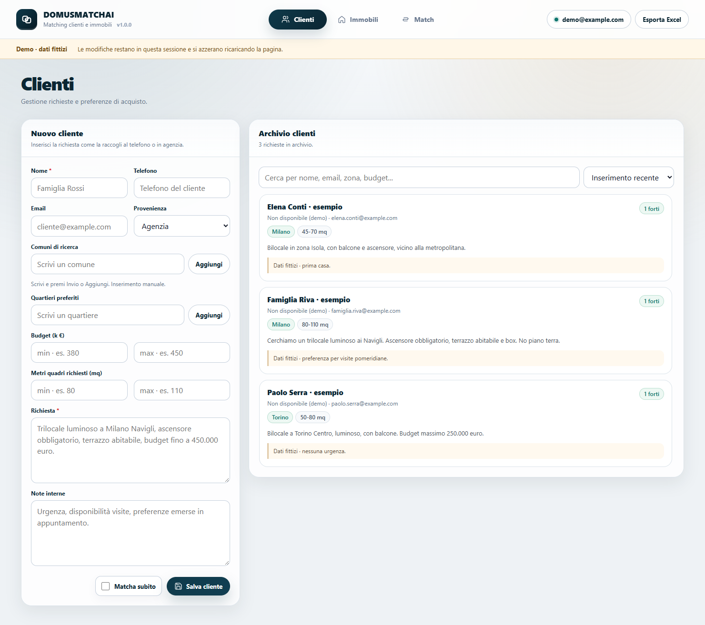
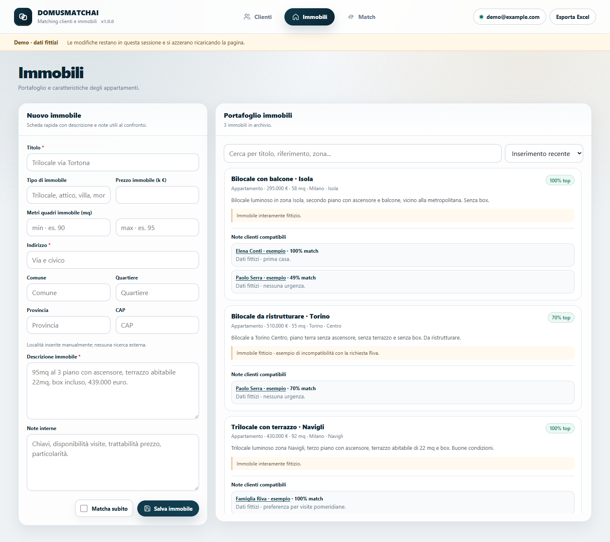
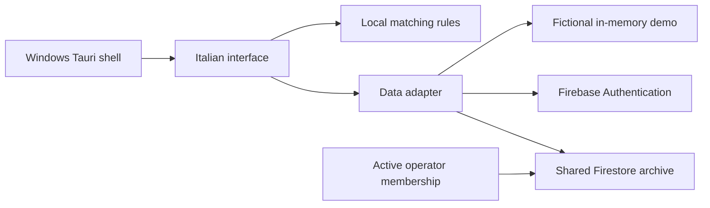

<p align="center"></p>

# DomusMatchAI

[](https://github.com/DavideWasTaken/DomusMatchAI/actions/workflows/checks.yml)
[](LICENSE)


**Turn a client's request into a property shortlist—with reasons you can read.**

DomusMatchAI brings client requests, available properties and explainable local matching into a small shared workspace. Built around the workflow of a real agency with three branches, this public edition uses its own configuration and fictional demo records.

**[Open the live demo](https://davidewastaken.github.io/DomusMatchAI/) · [Matching rules](docs/matching.md) · [Firebase setup](docs/firebase.md)**

No account or setup needed for the demo. The interface is in Italian; all demo changes stay in memory and reset on reload.



*Actual application screenshot, using the included fictional demo. Scores come from the matching engine.*

## What it does

- **Client requests:** contacts, budget, surface area, preferred municipalities/neighborhoods, descriptions and internal notes.
- **Property archive:** location, price, size, descriptions and searchable records.
- **Matching in both directions:** find properties for a client or clients for a property, with reasons, missing information and incompatibilities.
- **A shared agency workspace:** Firebase Authentication and Firestore keep authorized operators connected to the same records.
- **Practical follow-up:** copy a suggested message for manual review, and export clients, properties and current matches to an Excel-compatible XML workbook.
- **Windows desktop or browser:** a small Tauri shell around the same JavaScript interface.

### Where the “AI” fits

The current matching engine runs **locally**, using Italian text extraction, structured fields and weighted rules. It needs **no LLM, API key for AI or paid model service**. Firebase is only needed for the shared, authenticated workspace.

Every score comes with explanations. Missing information earns no matching credit and is shown separately from an explicit mismatch. “Criteria coverage” indicates how many evaluated criteria have known information; it is not a probability or statistical confidence. Read the [matching rules and limitations](docs/matching.md).

### A concrete example

The included Riva request asks for a trilocale in Milano/Navigli, EUR 350–450k, 80–110 mq, a usable terrace, lift and parking; it excludes the ground floor. The current engine produces:

| Fictional property | Rule score | What the operator sees |
| --- | ---: | --- |
| Navigli · 92 mq · EUR 430k | 100 | Location, budget, size and requested amenities supported by the record |
| Isola · 58 mq · EUR 295k | 30 | Wrong neighborhood, below the requested budget/size range, no parking; terrace unknown |
| Torino · 55 mq · EUR 510k | 0 | Wrong municipality, over budget, too small, ground floor and missing amenities |

These are scores for one request, not sale probabilities. Changing the request changes the evaluated criteria. Rankings and exports recompute current facts instead of trusting saved scores.

The parser also keeps `budget minimo 300k` distinct from a maximum, separates `terrazzo di 22 mq` from apartment area, and treats `non dispone di ascensore` or `senza posto auto` as explicit absence. These behaviors have regression tests, including contradictory descriptions and missing information.

## Try the demo

Requires **Node.js 22+** and npm. No Firebase account, Rust or credentials required.

```bash
git clone https://github.com/DavideWasTaken/DomusMatchAI.git
cd DomusMatchAI
npm ci
npm run demo
```

Open **http://127.0.0.1:5173**. The demo contains fictional clients and properties, uses the real matching engine, and allows editing records. Changes live in memory and reset when the page reloads. Demo mode never initializes Firebase and does not send property or client data to external services.

## Connect your agency to Firebase

Follow the [Firebase setup guide](docs/firebase.md) to create a project, enable email/password sign-in, deploy the included access rules and approve operators.

```bash
# Copy .env.example to .env and fill in your Firebase Web App configuration.
npm run dev
```

Each installation connects to **one agency's Firebase project**. Operators share the same archive across branches. The project does not implement separate branch permissions or multi-tenant SaaS accounts.

> Creating an Authentication user is not enough: that user's UID must also have a `members/{uid}` document with `active: true`. Membership is managed in the Firebase console, never by ordinary application users.

## A quick look

### Collect the request



### Keep the property archive current



All screenshots use the repository's demo fixtures. [Screenshot provenance](docs/images/README.md).

## Desktop development

Windows desktop development also requires Rust, Microsoft C++ Build Tools and WebView2. Follow the [official Tauri prerequisites](https://v2.tauri.app/start/prerequisites/) first.

```bash
npm run desktop:dev
npm run build
```

`npm run build` creates a Windows MSI under `src-tauri/target/release/bundle/msi/`. Configure `.env` **before building**: the Firebase Web App configuration is embedded in the frontend. Installers are not code-signed by this project. A ready-made installer is not included because each agency uses its own Firebase configuration.

The public edition has its own application identifier and does not import or connect to the original agency's installation.

## Development and checks

| Command | Purpose |
| --- | --- |
| `npm run demo` | Editable in-memory demo with fictional records |
| `npm run dev` | Browser development using your Firebase project |
| `npm test` | Matching and demo/session regression tests |
| `npm run test:rules` | Firestore access tests in the local emulator; requires Java 21+ |
| `npm run build:frontend` | Build the Firebase-enabled frontend |
| `npm run build:demo` | Build the standalone demo frontend |
| `npm run check:demo` | Verify the built demo excludes Firebase and works on a project subpath |
| `npm run preview` | Preview the last frontend build locally |
| `npm run desktop:dev` | Run the Tauri desktop shell |
| `npm run build` | Build the configured Windows desktop installer |

CI checks JavaScript regressions, the actual Firebase adapter and access rules against Auth/Firestore emulators, dependency audit, both frontend builds, Rust formatting/checks and unsigned Windows MSI packaging. It also checks that dummy Firebase configuration cannot leak into the demo bundle. The live demo deploys only after the checks pass on `main`.

Rules/adapter tests use the `demo-domusmatchai` project and require Java 21+, with no Firebase login or production credentials. The pinned Firebase CLI runs through `npx` only when needed; it is not an app dependency. The app's npm audit does not include that external CLI's own dependency tree.

## Architecture and scope



**Stack:** JavaScript, Vite, Firebase and Tauri/Rust. No separate application server or AI inference service is needed.

This is a small agency tool. It has no portal scraping, automatic messages, property valuation, appointment calendar or complete audit history. Concurrent edits to the same record use last-write-wins. Online access is required to establish an authorized shared-data session; the public edition uses memory-only record caching. Locations are entered manually.

Deletes require confirmation and remove the source plus up to 499 linked matches in one batch. New orphan matches are rejected by the rules; a second server query handles matches created during deletion. Interrupted cleanup is retried in the same page and reported explicitly. Closing that page loses the memory-only retry ticket, so an administrator may need to remove leftover orphan matches. Larger deletes are refused before removing the source.

For real agency data, configure and deploy your own Firebase project and rules, approve `members/{uid}.active`, arrange backups, and test a configured, signed installer on staff devices. CI packaging is a build check, not a customer deployment certification.

See [architecture and operational limits](docs/architecture.md), [Firebase setup](docs/firebase.md) and [matching details](docs/matching.md).

Small improvements and reproducible bug reports are welcome; see [contributing](CONTRIBUTING.md) and [security guidance](SECURITY.md).

## Author and license

Built by [Davide Gaglione](https://davide.sh). Released under the [MIT license](LICENSE).
